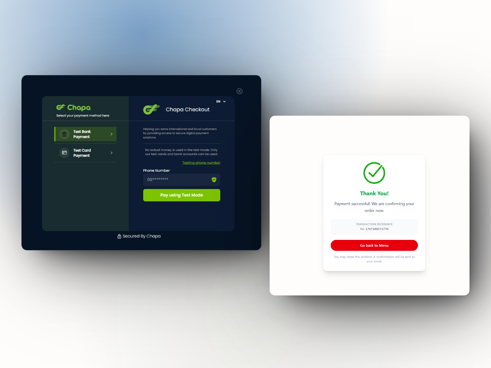

# Frontend Mentor - Product list with cart solution

This is a solution to the [Product list with cart challenge on Frontend Mentor](https://www.frontendmentor.io/challenges/product-list-with-cart-5MmqLVAp_d). Frontend Mentor challenges help you improve your coding skills by building realistic projects.

## Table of contents

- [Overview](#overview)
  - [The challenge](#the-challenge)
  - [Screenshot](#screenshot)
  - [Links](#links)
- [My process](#my-process)
  - [Built with](#built-with)
  - [What I learned](#what-i-learned)
  - [Continued development](#continued-development)
  - [Useful resources](#useful-resources)
- [Author](#author)

## Overview

### The challenge

Users should be able to:

- Add items to the cart and remove them
- Increase/decrease the number of items in the cart
- See an order confirmation modal when they click "Confirm Order"
- Reset their selections when they click "Start New Order"
- View the optimal layout for the interface depending on their device's screen size
- See hover and focus states for all interactive elements on the page

### Screenshot

s
### Links

- Solution URL: [Frontendmentor](https://www.frontendmentor.io/solutions/product-list-with-cart-chapa-payment-integrated-VnBLfWHjMd)
- Live Site URL: [Vercel](https://product-list-with-cart-delta-ten.vercel.app/)

## My process

### Built with

- Semantic HTML5 markup
- Mobile-first workflow
- Tailwind CSS
- [Svelte](https://svelte.dev/)
- [Chapa](https://developer.chapa.co/)

### What I learned

- Initiating a payment and verifying the payment using Chapa API.

### Continued development

### Useful resources

- [Chapa Documentation](https://developer.chapa.co/) - The documentation helped me on how to initiate a transaction and verify the transaction.

## Author

- Website - [Temesgen Adane](https://temesgen.vercel.app)
- Frontend Mentor - [@temesgen-982](https://www.frontendmentor.io/profile/temesgen-982)